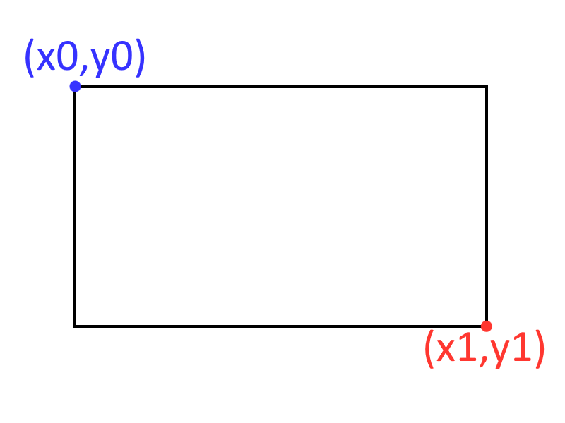

## Annotation structure

After the extraction,  the annotation is structured using the following structure,  list "property": "type"

```json
[
    {
        "type": "string",
        "page": "integer",
        "author": "string",
        "rect_coord": [
            "float",
            "float",
            "float",
            "float"
        ],
        "start_xy": [
            "float",
            "float"
        ],
        "text": "string",
        "content": "string",
        "created": "string",
        "modified": "string",
        "has_img": "boolean",
        "img_path": "string",
        "color": [
            "float",
            "float",
            "float"
        ],
        "index": "integer",
        "y": "float",
        "column": "integer",
        "color_name": "string"
    }
]
```

### Description of each field

- type: Describe the type of annotation. Example: Highlight,  Underline,  Squiggly,  Rect,  Ink,  FreeText,  Text
- page: Page's location of the annotation in the PDF file.
- author: Name of the author extract from PDF file.
- rect_coord: tuple of annotation location coordinates as percentage of page width and height. The order is: [x0, y1, x1, y1],  listed as the file:



- start_xy: coordinates x0,  y1.
- content: text extract from PDF file. This is a imutable content of the file. It is not created by the user.
- created: creation date of the annotation in the format YYYY-MM-DD HH:mm:ss
- modified: last modification date of the annotation in the format YYYY-MM-DD HH:mm:ss
- has_img: boolean variable informing if there is a image extracted from the annotation
- img_path: if there is a image,  list relative path of the image.
- color: tuple of annotation's color in RGB format. Scaled in 0 to 1.
- index: position of order position of the note in the page. 
- y: position of the note in the page. It is generate when ordering using columns.
- column: number of the column in the page.
- color_name: classification of the color. Example: Black,  White,  Gray,  Yellow,  Green,  Orange,  Cyan,  Blue,  Red,  Purple,  Pink,  Magenta.